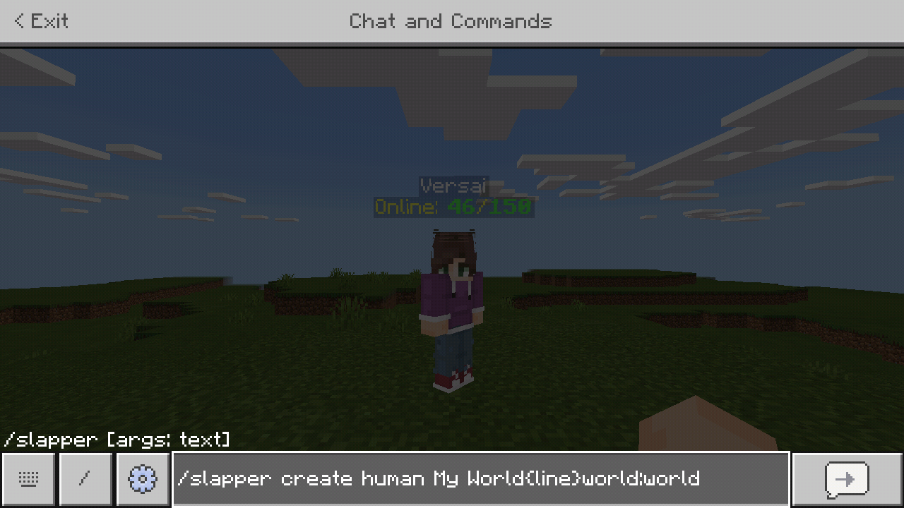
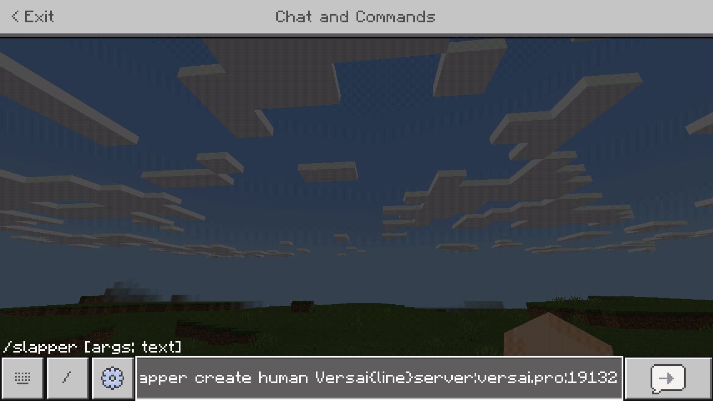

# SlapperPlayerCount
Get the amount of players on a world or on a server with SlapperPlayerCount!
**NOTICE:** Server domains are for some reason no longer working, you must use the direct IP of the server you want to query.
## Updates
### 2.1.1
- Disable WorldPlayerCount if installed and enabled on the server.
### 2.1
- Add config
- Add configurable nametags
- Add support for showing amount of players in a world
### 2.0
- Inital release
## Configuring Messages
If you go to the `plugin_data` folder for SlapperPlayerCount, you will see a config. You can change what the nametag will show for each event with the config.
## Usage
If you are confused, this is the place where you can go for answers. I will show how to use this plugin for getting the amount of players in a world, and the amount of players on a server.
### World Usage
When you have this plugin installed, go in-game and get your hands ready:
(**Note: The arguments must be on the second line of the plugin!**)
Type up the command to create a normal slapper like normal, with a name and everything:

`/slapper create human MiniGames`

From here, you want to seperate the amount of players from the name, so you would seperate it with the `{line}` tag.

`/slapper create human MiniGames{line}`

Now, since you want to get the amount of players on a world, you want to type in `world` and then the world name, spereated by a `:`.

Example: `/slapper create human MiniGames{line}world:minigames`

Then you get the amount of players on the world:

Hope this helped :D

~ ethaniccc

### Server Query Usage
When you have this plugin installed, go in-game and get your hands ready:
(**Note: The arguments must be on the second line of the plugin!**)
Type up the command to create a normal slapper like normal, with a name and everything:

`/slapper create human Versai`

From here, you want to seperate the amount of players from the name, so you would seperate it with the `{line}` tag.

`/slapper create human Versai{line}`

Now, since you want to get the amount of players on a server, you want to type in `server`, server ip, and the server port, spereated by a `:`.

Example: `/slapper create human Versai{line}server:versai.pro:19132`

Then you get the amount of players on the server:

Hope this helped :D

~ ethaniccc
